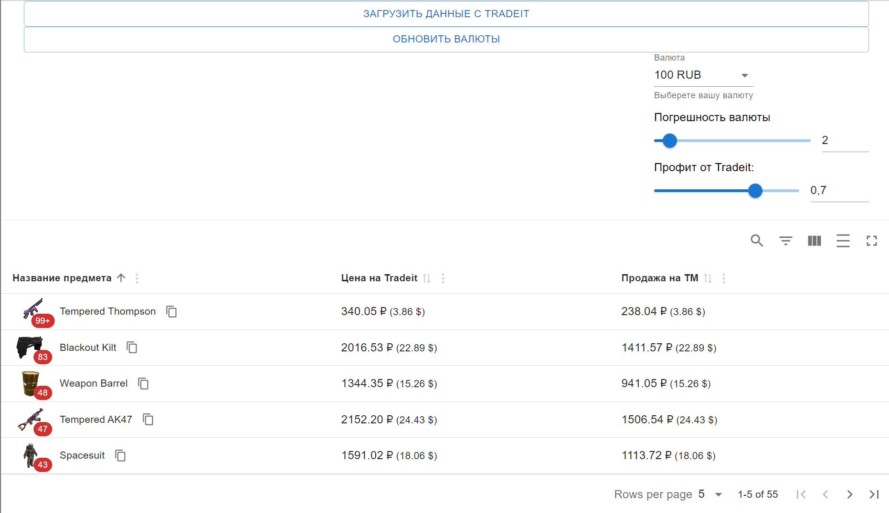

# steam-project

### ****Данный проект находиться в стадии разработки и предоставлен в качестве ознакомления***

**Steam-project** - это удобный интерфейс для просмотра предметов с сайта Tradeit и синхронизации с собственным инвентарем. 
API реализован отдельно от проекта - **[steam-api](https://github.com/NaNFull/steam-api)** 
его можно запустить локально, и приложение **steam-project** будет работать.
Данный функционал представляет собой тестовую функциональность и может вызывать ошибки. Используйте на свое усмотрение.
Проект использует пакетный менеджер Yarn v4 и node v20.
Другие пакетные менеджеры и версии node ниже v20 используйте на своё усмотрение.

## Содержание
- [Технологии](#технологии)
- [Приложение](#приложение)
- [Начало работы](#начало-работы)
- [To do](#to-do)
- [Релиз функционала на 14.01.24](#релиз-функционала-на-140124)
- [Релиз функционала на 28.01.24](#релиз-функционала-на-280124)
- [цели](#цели)

## Технологии
- [NodeJS v20](https://nodejs.org/)
- [TypeScript v5](https://www.typescriptlang.org/)
- [React](https://reactjs.org/)
- [Yarn v4](https://yarnpkg.com/blog/release/4.0)
- [eslint](https://eslint.org)
- [Vite](https://nodemon.io/)
- [MUI](https://mui.com/material-ui/)
- [material-react-table](https://www.material-react-table.com/)
- [steam-totp](https://github.com/DoctorMcKay/node-steam-totp)
- [steam-tradeoffer-manager](https://github.com/DoctorMcKay/node-steam-tradeoffer-manager)
- [steam-user](https://github.com/DoctorMcKay/node-steam-user)
- [steamcommunity](https://github.com/DoctorMcKay/node-steamcommunity)

## Приложение
```* Текущий вид может измениться в следующих релизах```




## Начало работы
Чтобы работать с 4 версией yarn, нужно установить ее первую версию глобально (Глобально v4 не нужно устанавливать):
```sh
$ npm install --global yarn
```

Установите пакет. В проекте указана зависимость с Yarn 4, которая будет использоваться **только для этого проекта**:
```sh
$ yarn
```

Собрать проект:
```sh
$ yarn build
```

Режим разработчика:

```sh
$ yarn dev
```

## To do
- [ ] Достигнуть итоговой модели api
- [ ] Добавить поддержку стилей .stylelintrc в Vite (возможно потребуется подключить cssnano, autoprefixer)
- [ ] Проверить необходимые правила в tsconfig.json
- [ ] Улучшить index.html
- [ ] Реализовать хук для поддержки разрешения экрана (мобильная разработка)

## Релиз функционала на 14.01.24
- [x] Создание главной страницы
- [x] Добавление тестовых фильтров
- [x] Добавление стейт-менеджера (Zustand)
- [x] Убрать расширение файлов по умолчанию из путей (правило allowImportingTsExtensions удалено)
- [x] Загрузка данных перед началом рендеринга
- [x] Добавлена история изменения цен предметов с сайта

## Релиз функционала на 28.01.24
- [ ] Добавить поддержку кеширования Server Workers
- [ ] Создать полноценную таблицу "Избранное" и добавление предметов в неё со страницы главного меню
- [ ] Создать метод для загрузки глобальных данных от getData Tradeit
- [ ] Перейти на Redux

Меньший приоритет:
- [ ] Подключить навигацию к таблице "Избранное" (просто шаблон)
- [ ] Добавить поддержку валют
- [ ] Разбить задачи (API, Model, Router) на маленькие кусочки и составить чек-лист по их выполнению

## Цели
- [ ] Добавить страницу своего инвентаря
- [ ] Добавить график продаж к предмету
- [ ] Добавить диаграмму/аналитику по личному инвентарю
- [ ] Перейти на Redux
- [ ] Добавить полноценный функционал по фильтрам
- [ ] Добавить поддержку мобильной версии
- [ ] Перенести разработку на ElectronJS
- [ ] Добавить профиль Steam

## Чек лист API, Model, Router
TODO: ----